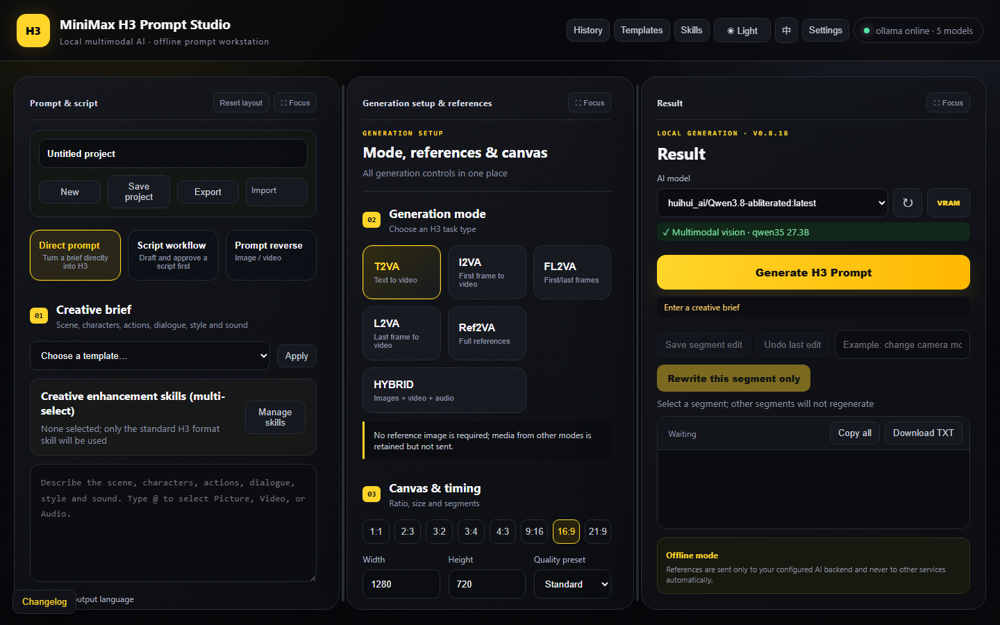
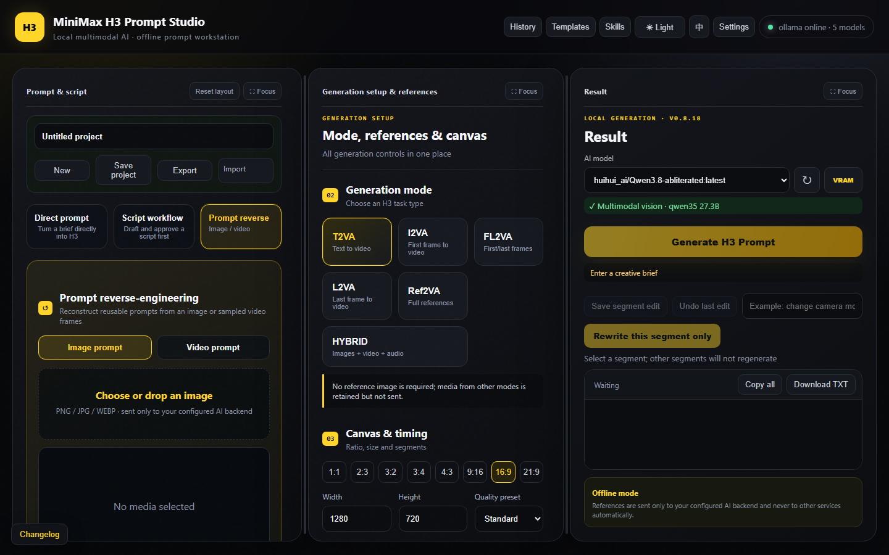

# MiniMax H3 Prompt Studio

[English](README.md) | [简体中文](README.zh-CN.md)

A local-first desktop prompt workbench for MiniMax H3. Create standard H3 prompts, develop and review segmented screenplays, or reverse-engineer reusable image and video prompts with local or LAN AI backends.

**Current source version:** v0.8.18 · **Latest published portable release:** v0.8.18 · **Platform:** Windows · **UI:** English / 简体中文

[Download the v0.8.18 EXE](https://github.com/Alan-Poo-Kai-Lun/minimax-h3-prompt-studio/releases/download/v0.8.18/H3PromptStudio-v0.8.18.exe) · [Release notes](https://github.com/Alan-Poo-Kai-Lun/minimax-h3-prompt-studio/releases/tag/v0.8.18) · [Changelog](CHANGELOG.md)

The portable EXE matches the current source release. You can also run from source or build the EXE using the instructions below.



## Highlights

- Resizable three-column desktop workspace: prompt and script, generation setup and references, and result
- Three independent entry points: Direct Prompt, Script Workflow, and Prompt Reverse
- Reverse-engineer image prompts or reconstruct H3/general video prompts from locally sampled video frames
- Built-in reverse rules or reusable custom reverse instructions with save, overwrite, and delete controls
- Focus mode for each column, remembered layout, and responsive behavior for 1366-pixel-wide displays
- Guided `Creative brief → Segmented script → Story review → Human approval → H3 prompt` workflow
- Story scoring, deterministic format checks, side-by-side highlighted revisions, targeted segment rewrites, and undo
- English plus a custom screenplay language, independent H3 output language, and mixed-language validation
- Approved dialogue preservation, speaker tracking, lip-sync requirements, and automatic H3 structure repair
- T2VA, I2VA, FL2VA, L2VA, Ref2VA, and flexible Hybrid generation modes
- Up to 12 Picture references with roles, preview, clipboard paste, copy, replacement, and drag sorting
- Automatic `<Picture N>` remapping after reference reordering
- Independent `<Picture N>`, `<Video N>`, and `<Audio N>` mentions through the `@` menu
- Drag-and-drop Video and Audio references with native preview controls and media information
- Custom Video timestamp capture to create or replace a first-frame Picture
- Media is retained when switching modes and excluded only from incompatible requests
- Ollama, LM Studio, llama.cpp Server, and OpenAI-compatible backends
- Searchable floating managers for history, templates, and creative enhancement Skills
- One-click full backup for templates, Skills, selected Skills, settings, generation parameters, layout, and reverse presets
- Optional model unload after generation to release VRAM
- Companion ComfyUI helper plugin

## Three workflows

| Workflow | Purpose | Key controls |
| --- | --- | --- |
| Direct Prompt | Convert an editable creative brief directly into H3 prompts | Templates, Skills, media mentions, output language, segment editing, and targeted rewrite |
| Script Workflow | Plan and approve a segmented story before H3 conversion | Bilingual screenplay, Story Check, highlighted comparison, exact dialogue preservation, and human approval |
| Prompt Reverse | Recover reusable prompts from an image or video | Image/video modes, H3 or generic video format, Chinese/English output, fixed rules, and saved custom instructions |

## Screenplay review and controlled revision

- Generate one canonical segmented screenplay, then optionally create an English + custom-language version without changing segment numbers, timing, references, or original dialogue.
- Story Check combines deterministic validation with an independent AI review of causality, motivation, continuity, pacing, transitions, and ending.
- The suggested revision never replaces the original automatically. Compare both sides with highlighted changes before applying it.
- Select one generated H3 segment to edit or rewrite only that segment; all other segments remain unchanged, and the latest modification can be undone.
- Final conversion restores approved dialogue to the matching shot, preserves speaker identity, and repairs incomplete H3 fields before accepting the result.

## Prompt reverse-engineering



- **Image prompt:** analyze subject, appearance, pose, environment, composition, lighting, color, material, visual style, and useful negative constraints.
- **Video prompt:** sample up to eight chronological frames locally, then reconstruct camera movement, subject motion, continuity, visual rhythm, and a MiniMax H3 or generic video prompt.
- Choose the built-in professional rule or write a custom analysis instruction. Custom instructions can be named, saved, overwritten, reused, and deleted.
- Image and video results are cached independently, so switching tabs does not discard an earlier result.
- Video reverse-engineering analyzes sampled frames only. It does not read or transcribe the original audio track.

## Generation modes

| Mode | Best for | Reference behavior |
| --- | --- | --- |
| T2VA | Text-to-video | Text only; saved media stays in the project but is excluded from the request |
| I2VA | First-frame animation | Picture 1 is the exact first frame |
| FL2VA | First-to-last-frame transition | Picture 1 is the first frame and Picture 2 is the final frame |
| L2VA | Ending-frame generation | Picture 1 is the exact final frame |
| Ref2VA | Full visual reference | Pictures define reusable subjects, environments, products, or style |
| Hybrid | Mixed reference workflows | Freely combine Pictures, Videos, and Audio; first and last frames are optional |

## Quick start

### Windows portable build

1. Download [H3PromptStudio-v0.8.18.exe](https://github.com/Alan-Poo-Kai-Lun/minimax-h3-prompt-studio/releases/download/v0.8.18/H3PromptStudio-v0.8.18.exe).
2. Start Ollama or another supported AI backend.
3. Run the EXE. The workspace normally opens at `http://127.0.0.1:8765`.
4. Open **Settings**, select the backend, enter its address, and test the connection.
5. Choose Direct Prompt, Script Workflow, or Prompt Reverse, then select a model and complete the visible workflow.

The EXE does not include Ollama or any AI model. A vision-capable model is required for Picture references and image/video prompt reverse-engineering. The portable build is currently unsigned, so Windows may identify it as an unrecognized application.

SHA-256 for v0.8.18:

```text
3DFE433E09DC2F0C7C7CDFE510F71517582A9BCEEE444F7C0E3E7BE30DCC1BC6
```

### Run from source

Python 3.10 or newer is required. The runtime server uses only the Python standard library.

```powershell
git clone https://github.com/Alan-Poo-Kai-Lun/minimax-h3-prompt-studio.git
cd minimax-h3-prompt-studio
python server.py
```

You can also run `start.bat`. The default backend is Ollama at `http://127.0.0.1:11434`. Configure another local, LAN, or OpenAI-compatible endpoint in Settings.

## Hybrid media workflow

Hybrid accepts any useful combination of reference Pictures, Videos, and Audio. A first-frame or last-frame keyframe is optional.

- Drop a Video into the Video reference area, describe its motion/editing purpose, and reference it as `<Video N>`.
- Preview the Video with sound or capture a custom timestamp as the first-frame Picture.
- Drop an Audio file into the Audio reference area, preview it, describe its role, and reference it as `<Audio N>`.
- Switch modes without losing uploaded media or reference descriptions.


## Projects, templates, Skills, and full backup

Projects can be created, saved, exported, and imported locally. Templates can be applied directly to the active Direct Prompt or Script Workflow instead of requiring manual copy and paste.

Imported `SKILL.md` content is included in screenplay and H3 generation requests to improve concepts, performance, visual style, shot design, pacing, and sound. A Skill cannot override the selected H3 mode, media numbering, segment count, output language, or standard H3 field structure.

The full settings backup exports and restores templates, the Skill library, selected Skills, backend and generation settings, layout preferences, and saved reverse instructions. API keys are excluded by default and require explicit inclusion. Projects, history, and project media remain separate project data.

## ComfyUI helper plugin

Copy `comfyui_plugin/ComfyUI-H3-Prompt-Studio` into the ComfyUI `custom_nodes` directory, restart ComfyUI, and refresh the frontend. See the [plugin README](comfyui_plugin/ComfyUI-H3-Prompt-Studio/README.md) for current installation and usage details.

The plugin is a companion integration and remains a test build. It is not yet feature-complete, and known issues remain.

## Privacy and data flow

- Projects, history, templates, Skills, settings, and media previews are stored in the current browser profile by default.
- Generation requests are sent only to the AI backend configured in Settings.
- Picture data may be included in a generation request when the selected mode and model use visual references.
- In normal H3 generation, original Video and Audio binaries are not uploaded to the AI backend; the request uses their filenames, roles, descriptions, and reference labels.
- In Video Prompt Reverse, the browser samples up to eight frames locally and sends those frame images to the configured AI backend. The original video file and audio track are not sent.
- If you configure a LAN or remote backend, applicable prompt data and Picture references are sent to that endpoint.
- API keys are stored in the current browser's local settings. Do not add keys to source files or commits.

## Build the portable EXE

```powershell
python -m pip install -r requirements-build.txt
python -m PyInstaller --noconfirm --clean H3PromptStudio-v0.8.18.spec
```

The output is written to `dist/H3PromptStudio-v0.8.18.exe`. Build artifacts and release executables are intentionally excluded from Git history.

## Troubleshooting

- **No models appear:** confirm that the selected backend is running, verify its URL in Settings, and test the connection.
- **Picture mode fails:** use a multimodal model that supports image input.
- **Prompt Reverse fails or returns weak visual detail:** select a vision-capable model and confirm that the configured backend accepts image input.
- **The browser opens an older build:** close older Prompt Studio processes. The app uses port `8765` first and falls back to `8766–8784` when necessary.
- **Video or Audio is not sent as a binary file:** this is intentional; these media files act as local preview and structured reference metadata.

## License

No open-source license has been added yet. Unless the repository owner grants separate permission, all rights are reserved.
